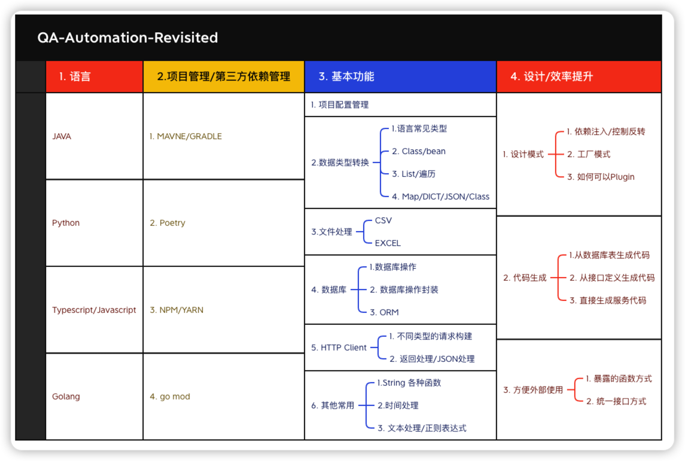

# README

FluentQA Workspace project is as A Project for QA:
1. Toolkits to handler QA Daily Work
2. Workspace Server for QA Daily Work
3. Learning JAVA in QA  perspective
4. Revisited JAVA after A QA writing JAVA several years
5. Easy to Use, Maintain and extend
6. All Codes are Used for Real Cases
7. All libs have its purpose in QA Daily Work

## 1. JAVA Revisited Overview

## 1.1 QA Java frequence used libs

### 1.1 OpenAPI Parser

- []

### 2. Real Cases
## 2.1. How to Build a Just-Working Test Case System in one day

- [slides](https://fluentqa-revistied.netlify.app/present/tc-mgt-one-day/#/1)