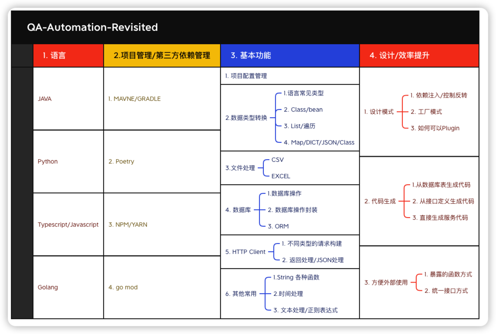

# README

FluentQA Workspace project is JAVA Project includes:

1. Toolkits to handler QA Daily Work
2. Workspace Server for QA Daily Work
3. Learning JAVA in QA  perspective
4. Revisited JAVA after A QA writing JAVA several years
5. Easy to Use, Maintain and extend
6. All Codes are Used for Real Cases
7. All libs have its purpose in QA Daily Work

But Actually not only for QA, it also for anyone want to create
JAVA Libs or Applications.

## 1. Software QA: JAVA Revisited Overview

**Automation Language Perspective**:

**Different Libs Perspective**:

## 1.1 QA Java frequent used libs

- [basic-libs](./components/fluent-builtin) basic JAVA Utils
- [excel-csv-operation](./components/fluent-excel) JAVA Excel/CSV Lib 
- [mindmap-operation](./components/fluent-mindmap) JAVA mindmap Lib
- [openapi-operations](./components/fluent-openapi) JAVA openapi lib
- [quick-database-operations](./components/fluent-quickdao) JAVA Database access Lib
- [markdonw-operations](./components/fluentqa-md) JAVA Markdown Lib
- [testlibs](./components/fluent-testlibs) JAVA test libs

### 2. Real Cases

## 2.1. How to Build a Just-Working Test Case System in one day

- [slides](https://fluentqa-revistied.netlify.app/present/tc-mgt-one-day/#/1)

## 3. Integration Libs

- [integration with other application](http://github.com/fluent-qa/fluent-integrations.git)

## stats

[//]: # (
)

[//]: # (    <a target="_blank" href="https://ihub.pub/">)

[//]: # (        )

[//]: # (        )

[//]: # (    </a>)

[//]: # (
)

---

[//]: # (
)

[//]: # (    <a target="_blank" href="https://bestpractices.coreinfrastructure.org/projects/7036">)

[//]: # (        )

[//]: # (    </a>)

[//]: # (    <a target="_blank" href="https://github.com/ihub-pub/libs/actions/workflows/gradle-build.yml">)

[//]: # (        )

[//]: # (    </a>)

[//]: # (    <a title="Test Cases" href="https://ihub-pub.testspace.com/spaces/219233?utm_campaign=metric&utm_medium=referral&utm_source=badge">)

[//]: # (        )

[//]: # (    </a>)

[//]: # (    <a target="_blank" href="https://www.codefactor.io/repository/github/ihub-pub/libs">)

[//]: # (        )

[//]: # (    </a>)

[//]: # (    <a target="_blank" href="https://codecov.io/gh/ihub-pub/libs">)

[//]: # (        )

[//]: # (    </a>)

[//]: # (    <a target="_blank" href="https://github.com/ihub-pub/libs">)

[//]: # (        )

[//]: # (    </a>)

[//]: # (    <a target="_blank" href="https://gitee.com/ihub-pub/libs">)

[//]: # (        )

[//]: # (    </a>)

[//]: # (    <a target="_blank" href="https://gitter.im/ihub-pub/libs?utm_source=badge&utm_medium=badge&utm_campaign=pr-badge&utm_content=badge">)

[//]: # (        )

[//]: # (    </a>)

[//]: # (    <a target="_blank" href="https://javadoc.io/doc/pub.ihub.lib">)

[//]: # (        )

[//]: # (    </a>)

[//]: # (    <a target="_blank" href="https://s01.oss.sonatype.org/content/repositories/snapshots/pub/ihub/lib">)

[//]: # (        )

[//]: # (    </a>)

[//]: # (    <a target="_blank" href="https://mvnrepository.com/artifact/pub.ihub.lib">)

[//]: # (        )

[//]: # (    </a>)

[//]: # (
)

[//]: # (组件库)

## 🧭 开源贡献指南

## 👨‍💻 Contributors

[//]: # ([![Contributors]&#40;https://contrib.rocks/image?repo=ihub-pub/libs&#41;]&#40;https://github.com/ihub-pub/libs/graphs/contributors "Contributors"&#41;)