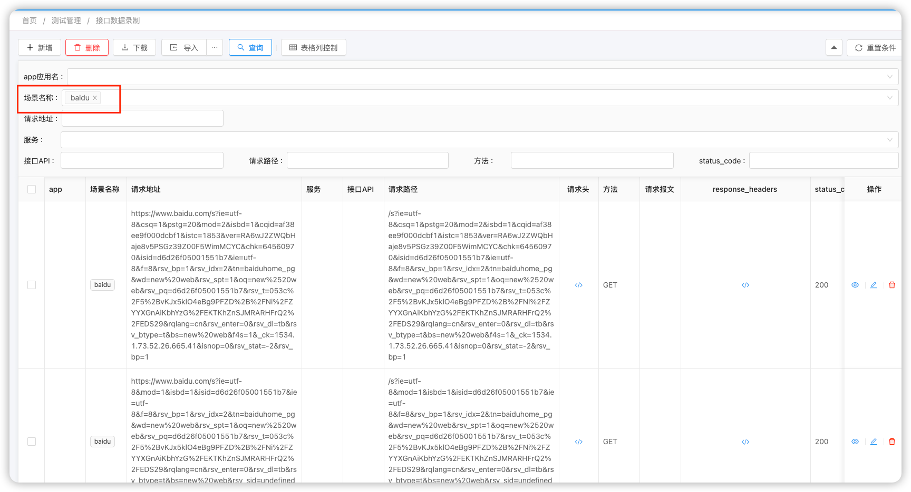
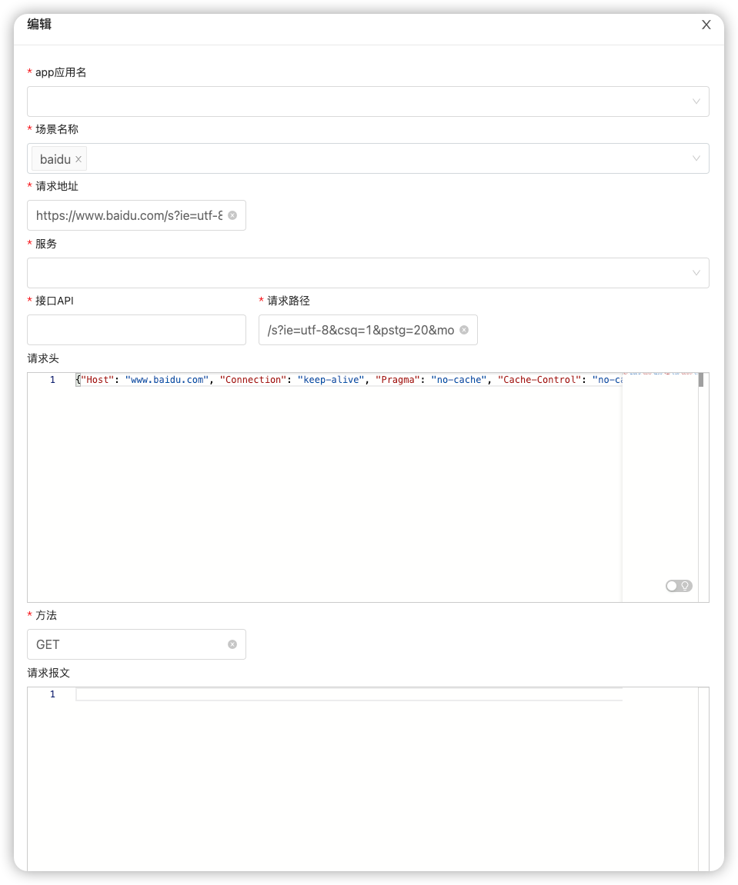

# API Record Server

上面提到的接口录制保存到数据库,
1. 可以是本地
2. 也可以是服务端

考虑到实际团队需要共享数据的情况,就进行了一个录制共享数据的后台原型。

下面是服务端页面的一个例子，还是一样，做这个后台主要是成本不高，实际也就是花了一天时间，当然每个人情况不同，这个需要额外考虑.

大体效果: **基本增删改查** 都实现了.



目前数据已经记录下来了，服务端也可以保存了，那么这个数据可以共享了. 通过下载功能可以把所有的录制场景下的请求和返回数据通过excel下载.

后续的修改和代码生成就是通过这个excel来进行了. 也可以只进行数据修改就可以，通过接口直接运行.

## 实现这样一个后台，其实就定义了一个实体

实现这样一个后台，其实就定义了一个实体,然后运行通过Springboot运行就可以,启动后相应的菜单都可以配置，
这个会在后面在详细介绍下，目前先把录制数据/下载说完了. 

```java
@Data
public class ApiMonitorRecord extends MetaModel {

    @EruptField(
            views = @View(title = "app"),
            edit = @Edit(
                    title = "app应用名",
                    type = EditType.TAGS, search = @Search(vague = true), notNull = true,
                    tagsType = @TagsType(
                            fetchHandler = SqlTagFetchHandler.class,
                            fetchHandlerParams = "select distinct app from api_monitor_record"
                    )
            ))
    private String app;
    @EruptField(
            views = @View(title = "场景名称"),
            edit = @Edit(title = "场景名称",
                    type = EditType.TAGS, search = @Search(vague = true), notNull = true,
                    tagsType = @TagsType(
                            fetchHandler = SqlTagFetchHandler.class,
                            fetchHandlerParams = "select distinct scenario_name from api_monitor_record"
                    )
            ))
    private String scenarioName;
    @EruptField(
            views = @View(title = "请求地址"),
            edit = @Edit(title = "请求地址", notNull = true, search = @Search)
    )
    private String requestUrl;

    @EruptField(
            views = @View(title = "服务"),
            edit = @Edit(
                    title = "服务",
                    type = EditType.TAGS, search = @Search(vague = true), notNull = true,
                    tagsType = @TagsType(
                            fetchHandler = SqlTagFetchHandler.class,
                            fetchHandlerParams = "select distinct service from api_monitor_record"
                    )
            )
    )

    private String service;
    @EruptField(
            views = @View(title = "接口API"),
            edit = @Edit(title = "接口API", notNull = true, search = @Search)
    )
    private String api;

    @EruptField(
            views = @View(title = "请求路径"),
            edit = @Edit(title = "请求路径", notNull = true, search = @Search)
    )
    private String path;

    @EruptField(
            views = @View(title = "请求头"),
            edit = @Edit(title = "请求头", type = EditType.CODE_EDITOR, codeEditType = @CodeEditorType(language = "json"))
    )
    private String requestHeaders;

    @EruptField(
            views = @View(title = "方法"),
            edit = @Edit(title = "方法", notNull = true, search = @Search)
    )
    private String method;

    @EruptField(
            views = @View(title = "请求报文", type = ViewType.CODE),
            edit = @Edit(title = "请求报文", type = EditType.CODE_EDITOR,
                    codeEditType = @CodeEditorType(language = "json"))
    )
    private String requestBody;

    @EruptField(
            views = @View(title = "response_headers"),
            edit = @Edit(title = "responseHeaders", type = EditType.CODE_EDITOR,
                    codeEditType = @CodeEditorType(language = "json"))
    )
    private String responseHeaders;

    @EruptField(
            views = @View(title = "status_code"),
            edit = @Edit(title = "status_code", notNull = true, search = @Search)
    )
    private int statusCode;

    @EruptField(
            views = @View(title = "返回报文", type = ViewType.CODE),
            edit = @Edit(title = "返回报文", type = EditType.CODE_EDITOR,
                    codeEditType = @CodeEditorType(language = "json"))
    )
    private String responseBody;


}

```

## 工作量和效果

- 功能: 
  1. 基本的增删改查都可以,下面是个编辑页面，支持代码高亮和JSON等
    
  2. 支持不同录制场景的查询
- 工作量：
  - 这个server框架由于之前了解，所以这个时间我自己没有考虑在里面
  - 后台的构建我自己也就今天1个下午
- 后续打算
  - 和自动化框架做对接，下载的EXCEL经过修改之后可以用作接口测试
  - 录制场景修改完的数据，可以用来造数据，通过管理后台实现
  - 自动化跑的CASE进行记录
  - 录制的数据和目前所有的API清单做一个对比，可以知道那些有接口测试覆盖了

其实按照目前的效果看,后续打算里面的内容都会在这几天里面可以完成一个原型。

## 不足

目前肯定是比较粗糙的, 主要还是实现成本低，来验证思路是否符合实际情况的使用，是否真的可以提高效率.
也欢迎大家多提意见和建议，有人反馈是最开心的事情. 

后台代码在: 
