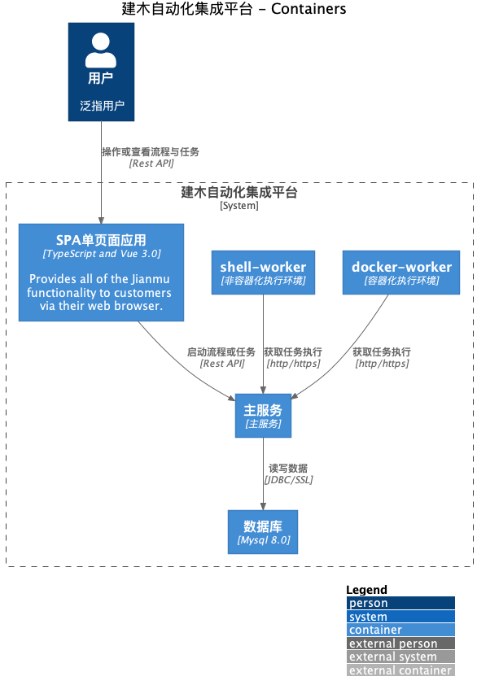
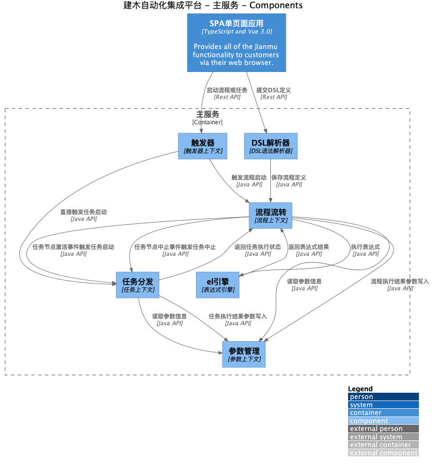
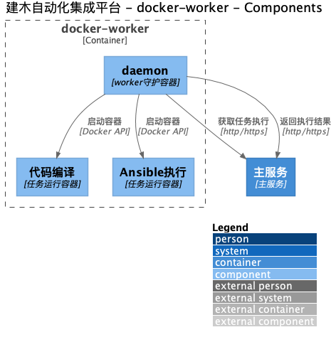
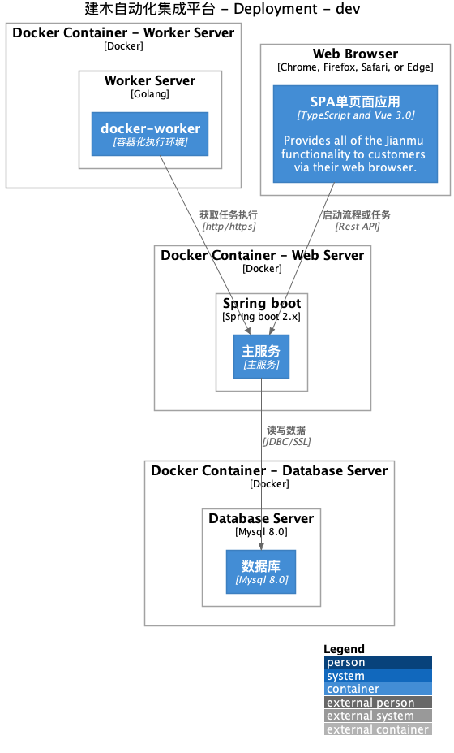

# jianmu-architecture-as-code

#### 介绍
建木架构即代码(architecture as code)

#### 使用说明

本项目使用[Structurizr DSL](https://github.com/structurizr/dsl) 的Cli工具来生成C4 Model的架构图

该工具可以输出为PlantUML格式文件

Mac环境下可以使用Homebrew安装该工具

```
brew install structurizr-cli
```

安装完成后，可以使用以下命令来生成.puml文件到c4文件夹下

```
structurizr-cli export -workspace jianmu.dsl -format plantuml -output c4
```

#### 生成效果

*建木容器图*


*主服务内部组件图*


*执行器组件图*


*服务部署图*
