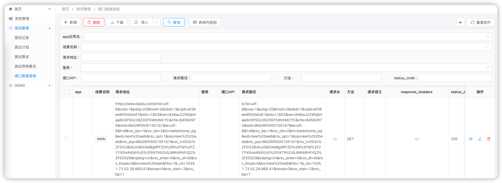

# README

QA Automation/Coding Revisited MindMap:

> It is not about learn every piece of JAVA language first.
please spend less time on syntax, use more time on coding to
complete some your daily task.

## Layers

- Utilities Layers: Different Toolkits
    - [X] Configuration
    - File/IO Handler
    - OS Handlers
    - Database Accessor
    - CSV/EXCEL/XML/JSON/YAML Handler
    - Different Clients:
        - HTTP Client
        - Redis Client
        - Database Client
    - Meta
        - Reflection
        - Class/Method/Arguments Resolver
        - DI Container

- Service Layer:
    - DATA Access/Repository Layer
    - Service Domain: Compose Different Repositories and API Integration
- Integration/SDK Layer:
    - Different SDKs to connect different Service
    - Easy to Compose different integration and services
- API Layer:
    - Easy to Create Different Protocol API to exposure
    - Easy to do API Registration

## FluentQA-Modules

- [fluent-builtin](./fluentqa-builtin) based-on different tools
  Use java for  QA Daily Work:
    1. code to handle  different data and client:
        1. json/map
        2. csv/excel
        3. redis/http/database
    2. build internal admin system
    3. integration testing
    4. automation testing
- [fluentqa-data](./fluentqa-modules/fluentqa-data) data access layers
    - [quick-dao](./fluentqa-modules/fluentqa-data/fluent-quickdao) only for testing,data preparation
    - [jpa-dao](./fluentqa-modules/fluentqa-data/fluent-jpa-data) jpa data operations

## 2.Docs
## 2.1 Dao for tester
- [quick-dao usage](docs/qa-java-toolkits/data/quick-dao.md)

## 3. To Do List
### 3.1 extensions: for daily use or integrated in an app
- [] Excel/CSV Toolkit
- [] Mindmap Toolkit
- [] openapi toolkit
- [] Database Operation Simplify

## 3.2 Integrations: to integrate with third-party app by API
- [] feishu/飞书
- [] vika 表格
- [] seatable
- [] .......

## 4. Modularization

1. modularization: compose different modules to build an app
    - [] Generic DTO
    - [] Generic Exceptions
    - [] Logging Aspect
    - [] spring starters

##  5. QA-LowCode Thoughts

1. [] Application Code Structures:
- Configuration
- API: 对外
- Service: 对内部，细颗粒度
- Repository： 数据访问层
- Configuration: 系统配置
- Core/Base: 常用方法和客户端组件调用方法/流程组合/控制反转/依赖注入
2. [] Code Generate
- [] Database Table  -> Entity/Repository/Service Code/Api Codes
- [] Different Templates Support/Configurable
- [] UI Code Generation

## 6. Reference
- Hutool: https://hutool.cn/docs
- Excel:
    - https://github.com/liaochong/myexcel.git
    - https://ozlerhakan.github.io/poiji
- [manifold-system](http://manifold.systems/)

## tools

- [QR Code](QR code)

# To Do List

-  [X] built-in : Done
    - [] meta: reflection/class utils
    - [] meta: aop/proxy
- [X] SimpleDao : Done
- [X] Excel: Done
- [] JPA Simple
- [] Data Transform

## TODO:

- https://github.com/domaframework/doma.git
- https://docs.jmix.cn/jmix/2/tutorial/index.html