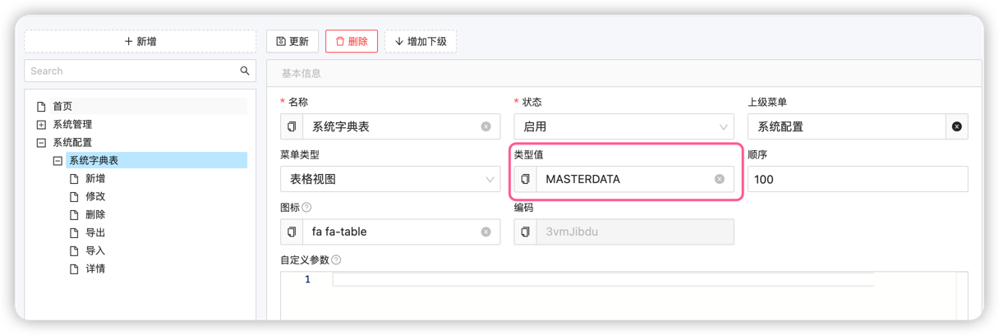

# 极简测试管理系统: 第一个功能之增删改查列表

了解学习一个东西可能没有什么好方法，就是下面几步：
1. 从简单入手
2. 逐步复杂，理解更多概念
3. 理解概念之间的逻辑,通过逻辑推导举一反三

## 从最简单入手

最简单功能其实就是一个增删改查表,实现一个系统字典表需要做哪些？
系统字典表主要用来记录一些系统常量:
1. 比如什么优先级P1，P2这种可以用来配置的东西
2. 这个功能是最典型的后台增删改查功能,是学习erupt最好的入门案例

## 先说实现的效果


实现以上内容需要哪些工作：
- 数据库设计？
- 前端？
- 后端？
- 其实只要一个JAVA类......, 认真的.......

可以说都需要,也可以说都不需要.

实际上需要做的是


## 一个JAVA文件一个增删改查页面

```java
package io.fluentqa.workspace.base.model;

import io.fluentqa.workspace.base.handlers.SqlTagFetchHandler;
import lombok.Data;
import xyz.erupt.annotation.Erupt;
import xyz.erupt.annotation.EruptField;
import xyz.erupt.annotation.sub_erupt.Layout;
import xyz.erupt.annotation.sub_erupt.Power;
import xyz.erupt.annotation.sub_field.Edit;
import xyz.erupt.annotation.sub_field.EditType;
import xyz.erupt.annotation.sub_field.View;
import xyz.erupt.annotation.sub_field.sub_edit.InputType;
import xyz.erupt.annotation.sub_field.sub_edit.Search;
import xyz.erupt.annotation.sub_field.sub_edit.TagsType;

import javax.persistence.Entity;
import javax.persistence.Table;


@Erupt(name = "产品字典值配置",
        power = @Power(importable = true,
                export = true),
        layout = @Layout(
                tableLeftFixed = 3,
                pageSize = 30
        ))
@Table(name = "master_data")
@Entity
@Data
public class MasterData extends ModelWithValidFlagVo {

    @EruptField(
            views = @View(title = "分类"),
            edit = @Edit(
                    search = @Search(vague = true),
                    title = "获取可选种类",
                    type = EditType.TAGS,
                    desc = "动态获取可选种类",
                    tagsType = @TagsType(
                            fetchHandler = SqlTagFetchHandler.class,
                            fetchHandlerParams = "select distinct category from master_data where valid=true"
                    ))
    )
    private String category;

    @EruptField(
            views = @View(
                    title = "名称"
            ),
            edit = @Edit(
                    title = "名称",
                    type = EditType.INPUT, search = @Search, notNull = true,
                    inputType = @InputType
            )
    )
    private String name;

    @EruptField(
            views = @View(
                    title = "详细描述"
            ),
            edit = @Edit(
                    title = "详细描述",
                    type = EditType.INPUT,
                    inputType = @InputType
            )
    )
    private String detail;

    @EruptField(
            views = @View(
                    title = "代号"
            ),
            edit = @Edit(
                    title = "代号",
                    type = EditType.INPUT, search = @Search, notNull = true,
                    inputType = @InputType
            )
    )
    private String code;

}
```

## 启动看效果

1. 一开始什么也没有
2. 进行菜单配置



