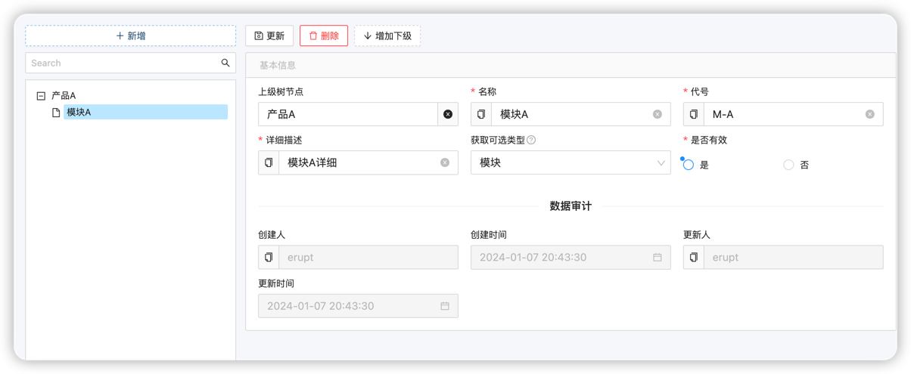
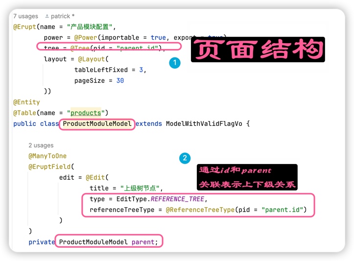
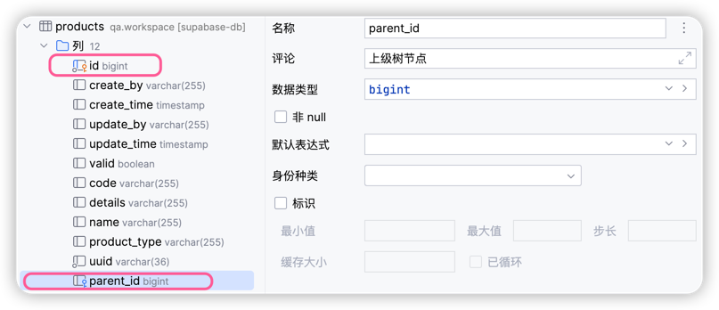

# 产品-模块配置

测试管理系统中需要给测试用例，测试任务，自动化用例归类到产品或者模块。
那么我们就来进行产品模块分类的开发，主要用来给后续测试用例管理做配置使用。

## 产品/模块配置信息

一般实际过程中，产品模块配置信息是一个树形结构，也就是:
1. 产品A
2. 产品A下面有模块A，模块B
3. 模块A下面有子模块A1，A2

所以他就是一个树形结构,需要实现的样子是:



看起来有点复杂，实现起来呢？***不复杂***，还是只要一个JAVA类

## 实现产品/模块配置信息树形结构页面

***一个JAVA类实现***

```java
@Erupt(name = "产品模块配置",
        power = @Power(importable = true, export = true),
        tree = @Tree(pid = "parent.id"),
        layout = @Layout(
                tableLeftFixed = 3,
                pageSize = 30
        ))
@Entity
@Table(name = "products")
public class ProductModuleModel extends ModelWithValidFlagVo {

    @ManyToOne
    @EruptField(
            edit = @Edit(
                    title = "上级树节点",
                    type = EditType.REFERENCE_TREE,
                    referenceTreeType = @ReferenceTreeType(pid = "parent.id")
            )
    )
    private ProductModuleModel parent;

    @EruptField(
            views = @View(
                    title = "名称"
            ),
            edit = @Edit(
                    title = "名称",
                    type = EditType.INPUT, search = @Search,
                    notNull = true,
                    inputType = @InputType
            )
    )
    private String name;

    @EruptField(
            views = @View(
                    title = "代号"
            ),
            edit = @Edit(
                    title = "代号",
                    type = EditType.INPUT, search = @Search,
                    notNull = true,
                    inputType = @InputType
            )
    )
    private String code;

    @EruptField(
            views = @View(
                    title = "详细描述"
            ),
            edit = @Edit(
                    title = "详细描述",
                    type = EditType.INPUT, search = @Search, notNull = true,
                    inputType = @InputType
            )
    )
    private String details;

    @EruptField(
            views = @View(title = "类型"),
            edit = @Edit(
                    search = @Search,
                    title = "获取可选类型",
                    type = EditType.CHOICE,
                    desc = "动态获取可选类型",
                    choiceType = @ChoiceType(
                            fetchHandler = SqlChoiceFetchHandler.class,
                            fetchHandlerParams = "select id,name from master_data where category='PRODUCT'"
                    ))
    )
    private String productType;
}
```

- 菜单配置

## 树形页面的中重点



数字库表结构:



这是一张递归结构的表，parent_id是父节点id，id是当前节点id，name是当前节点名称。

## 总结

层级结构/树形结构页面的实现: 
1. Model 定义中有一个 parent的字段，表示父节点id，类型就是这个类本身
2. 数据库的递归结构: 通过id和parent.id关联就可以查找所有的子节点,这些数据本身都在一张表里面


