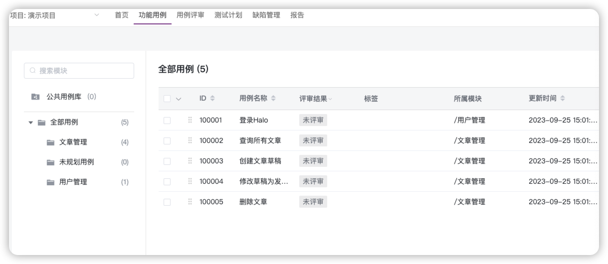
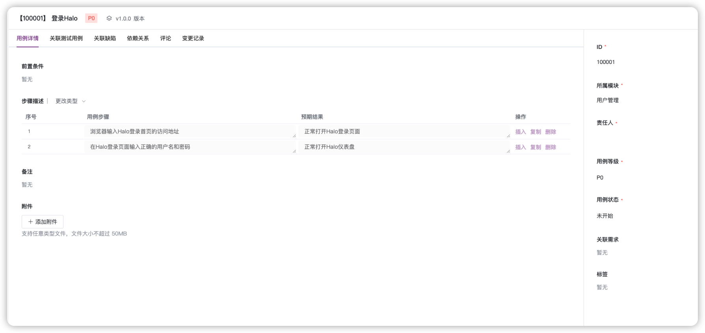
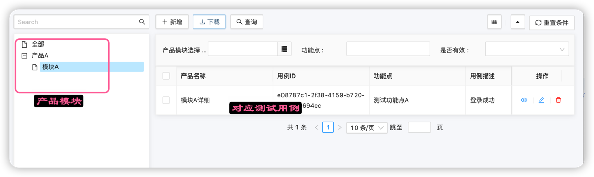
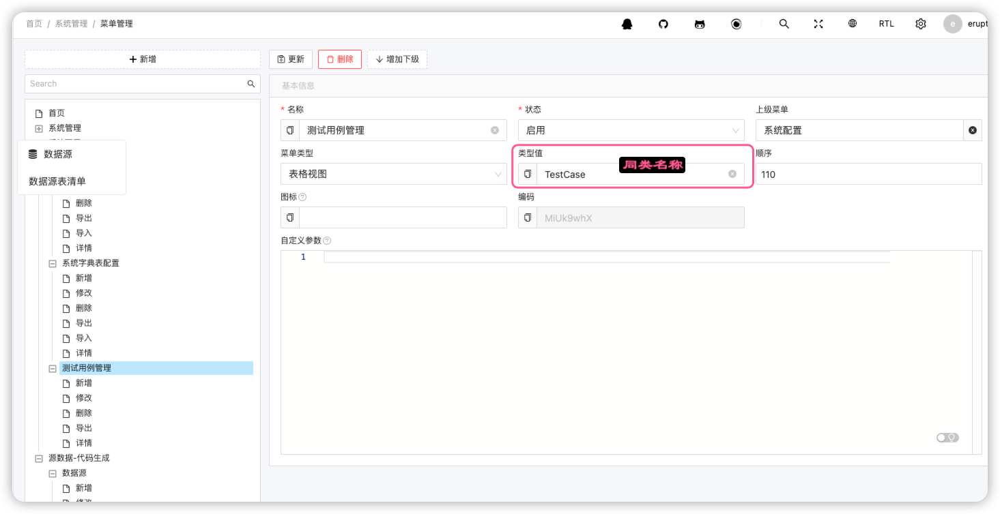

# 极简测试用例管理实现-用例增删改查

关于极简系列的说明: 

> 难者不会,会者不难

事实: 不管这个事情难还是容易,如果你不会，你就是不会; 这个和这个事情有没有技术含量没有关系
写代码: 不管写代码难不难，你如果不能熟练快速的写出一些可以用的，你就是不会;这和写代码时候有技术含量没关系
技术含量: 技术含量这个词没有任何意义，就是一个主观判断，会的人觉得没技术含量，不会的人觉有有技术含量，看着简单不代表没有技术含量
熟练: 熟练也是技术含量,熟练就是生产力，生产力提高就是有技术含量

极简系列的目的: 

- 极简系列教程只用最简单的说明，讲述如何实现，不存在任何技术含量. 
- 极简系列教程主要的价值就是是个人二次实践和二次加工过的内容，能起到的作用就是上你看文档实践，作出一个东西的实践少点
- 没有不得了的技术，但是可以降低你做一个能用东西的成本


## 测试用例用例增删改查

测试用例管理是测试平台常见功能,Metersphere技术用例功能

- 测试用例模块



- 用例详细的添加编辑


总结以上功能主要实现是:
1. 测试用例的增删改查
2. 测试用例关联到产品/模块/测试用例集合

问题: 如果单独实现这样一个刚刚够用的类似功能(前端交互一般),需要多久？
答案: 4个小时足够，如果做参考下面

## 自制测试用例管理页面

完成以下两个页面基本就完成Metersphere的测试用例管理中的测试增删改查和
测试用例模块关联的功能了.

- 用例展示

- 用例编辑


## 30分钟实现

如果要实现以上功能如果一个熟练工需要话多久: 30分钟实现差不多,
如何实现:
1. **还是一个JAVA类** 对应测试用例的数据库表
2. **这个JAVA类中关联产品模块**表
3. 系统配置菜单

以上三步完成就能完成一个极简测试管理用例.

## 最终的JAVA类

```java
@Data
@Entity
@Erupt(name = "测试用例",
        power = @Power(export = true),
        orderBy = "TestCase.updateTime desc",
        linkTree = @LinkTree(field = "module"))
@Table(name = "test_cases")
public class TestCase extends ModelWithValidFlagVo {

    @ManyToOne
    @JoinColumn(name = "product_id")
    @EruptField(
            views = @View(title = "产品名称", column = "details"),
            edit = @Edit(
                    notNull = true,
                    search = @Search,
                    title = "产品模块选择",
                    type = EditType.REFERENCE_TREE,
                    desc = "动态获取产品",
                    referenceTreeType = @ReferenceTreeType(id = "id", label = "name",
                            pid = "parent.id"))
    )
    private ProductModuleModel module;

    @EruptField(
            views = @View(
                    title = "用例ID"
            )
    )
    private String uuid = UUID.randomUUID().toString();

    @EruptField(
            views = @View(
                    title = "用例描述"
            ),
            edit = @Edit(
                    title = "用例描述",
                    type = EditType.INPUT, notNull = true, inputType = @InputType(fullSpan = true)
            )
    )
    private String summary;

    @EruptField(
            views = @View(
                    title = "用例优先级"
            ),
            edit = @Edit(
                    title = "用例优先级",
                    type = EditType.CHOICE,
                    choiceType = @ChoiceType(
                            fetchHandler = SqlChoiceFetchHandler.class,
                            fetchHandlerParams = {"select distinct code " +
                                    "from master_data where category ='优先级' and valid =true"}
                    )
            )
    )
    private String priority = "P2";

    @EruptField(
            views = @View(
                    title = "用例前提条件"
            ),
            edit = @Edit(
                    title = "用例前提条件",
                    type = EditType.TEXTAREA)
    )
    private String precondition;

    @EruptField(
            views = @View(
                    title = "测试步骤"
            ),
            edit = @Edit(
                    title = "测试步骤",
                    type = EditType.TEXTAREA
            )
    )
    private String steps;
    @EruptField(
            views = @View(
                    title = "用例期望结果"
            ),
            edit = @Edit(
                    title = "用例期望结果",
                    type = EditType.TEXTAREA
            )
    )
    private String expectedResult;
}
```

是的其实就是这样一个类就完成了所有的功能，并不会有任何夸张. 

## 关于这个类的说明

这个类的说明其实为:
1. 测试用例需要记录哪些字段，这个例子中使用的是最简单的字段
2. 每个字段使用什么页面元素展示,怎么用JAVA来表示，这个例子中主要有以下几种:
   * EditType.INPUT: 文本框, 比如用例描述这个字段
   * EditType.CHOICE: 下拉框, 比如优先级这个字段, 问题：下拉选项从哪里来？
   * linkTree = @LinkTree(field = "module"): 这个表示树形结构
   * EditType.REFERENCE_TREE: 树形结构, 比如模块这个字段, 问题：树形结构的数据从哪里来？
3. 关于两表关联, 使用了如下注解，这些注解在实际情况如何功能
  ```java
      @ManyToOne
    @JoinColumn(name = "product_id")
  ```

如果你对以上问题都比较熟练了，那么做这个功能可能只需要20分钟，就是设计以下表结构.

## 最后运行程序配置菜单



自此类似于一个Meterspher的测试用例增删改查，关联的功能就完成了.
你说这个测试有什么用，目前看其实没有实际意义,因为实际情况是:
1. 不会怎么写用例，用例一般是脑图或者EXCEL批量完成
2. 即使保存下来了，那么如何更新呢？

那么做这么一个功能的好处是什么:
1. 作为一个最基础功能
2. 有了一个统一保存测试用例的地方
3. 可以在上面进行优化，来解决如何让批量的用例进入系统和进行方便更新
4. 可以在上面叠加功能，比如:
   - 测试用例REVIEW
   - 一个大功能迭代可以将保存的测试用例精确分工，将用例分配到人
   - 根据测试用例的分配情况进行测试进度跟踪，可以追踪到具体的人
   - 可以在这个基础上进行一些统计
   - 可以用测试用例的方式记录需求，让需求不只是在人的脑子里面
   - 可能还有不少

## 下集预告

***上传脑图和EXCEL批量添加测试用例的功能***
