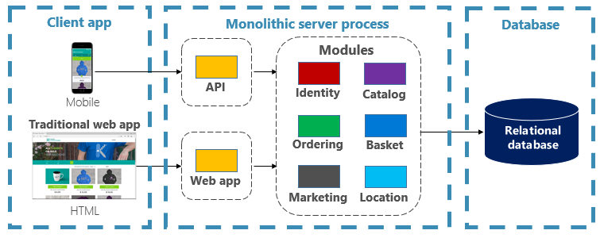
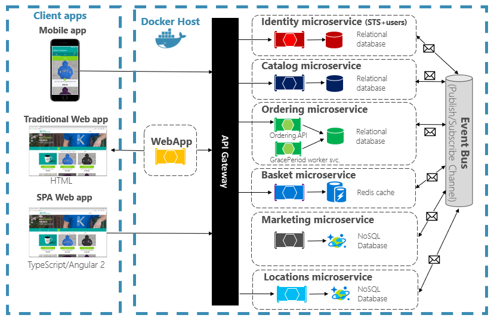
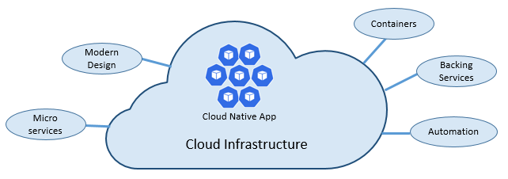
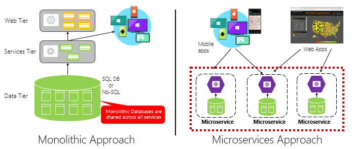
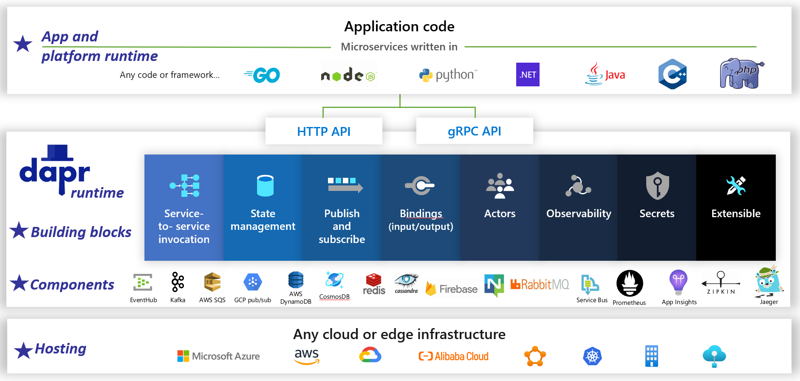
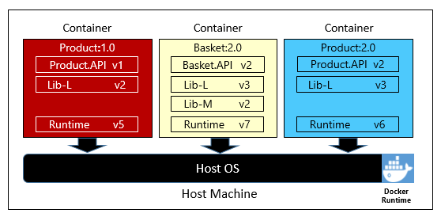
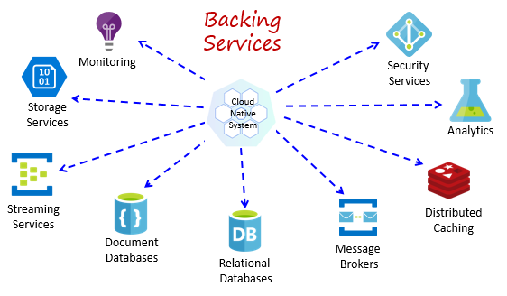
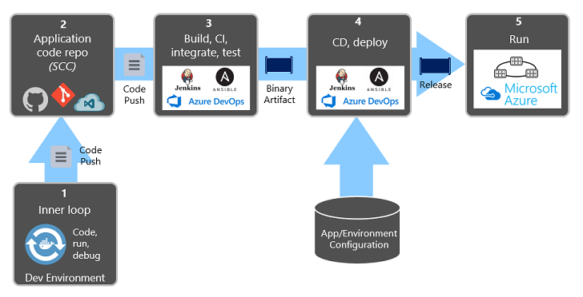

# Application Dev Lifecycle

- Requirement/UI/UX
- API Design
- Code Generation
- Coding
- Integration Testing
- Testing
- Release
- Smoke Testing

## Mono APP

## Microservice

## Cloud Native

## Reference

- https://learn.microsoft.com/en-us/dotnet/architecture/cloud-native/definition