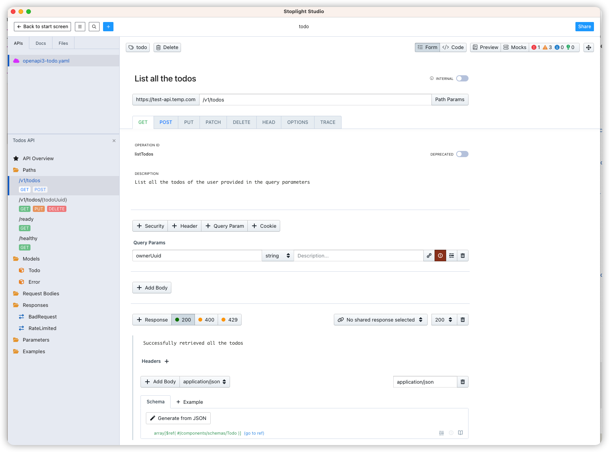

# API 定义阶段

1. 需求分析
2. 前后台交互分析
3. 接口定义文档

## 接口定义文档格式

- openapi3
- swagger
- postman
- skel
- protobuff

## 工具使用

1. postman
2. insomina
3. Stoplight Studio - API Design
4. Intellj Plugin - Skel

## API 定义

## API 定义

HTTP 协议:
- request url
- method
- request header
- request body
- response body
- response header

## Reference

- [todo-api-spec](https://github.com/gavincornwell/todo-api-spec.git)