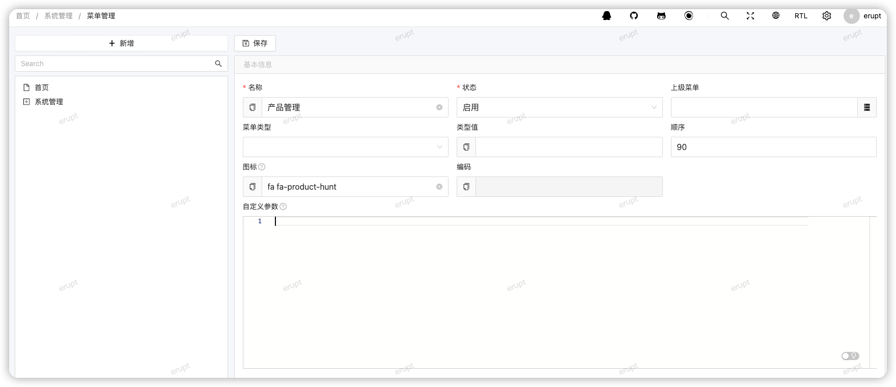
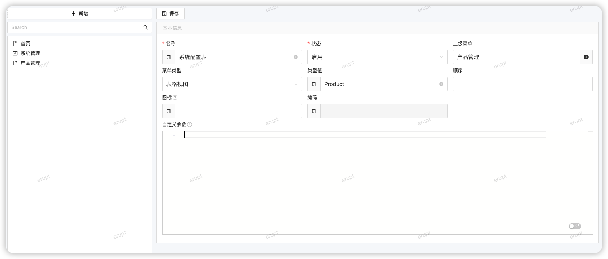
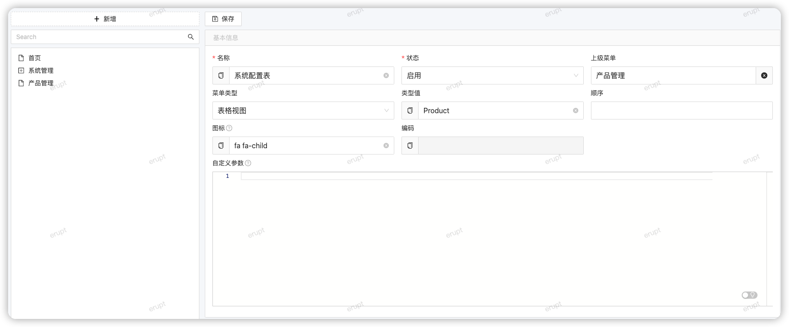
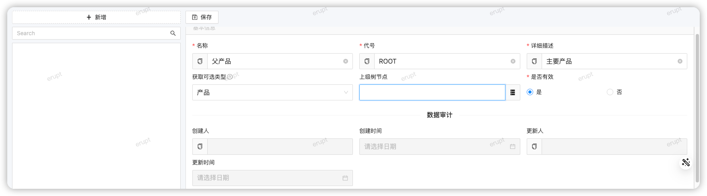
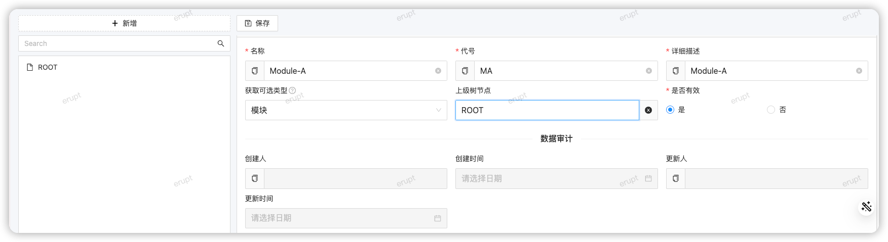

# README



```java

import java.util.UUID;

@Erupt(name = "产品模块元数据",
        power = @Power(importable = true, export = true),
        tree = @Tree(pid = "parent.id"))
@Entity
@Table(name = "products")
@Data
public class Product extends ModelWithValidFlagVo {

    @EruptField(
            views = @View(
                    title = "名称"
            ),
            edit = @Edit(
                    title = "名称",
                    type = EditType.INPUT, search = @Search,
                    notNull = true,
                    inputType = @InputType
            )
    )
    private String name;

    @EruptField(
            views = @View(
                    title = "代号"
            ),
            edit = @Edit(
                    title = "代号",
                    type = EditType.INPUT, search = @Search,
                    notNull = true,
                    inputType = @InputType
            )
    )
    private String code;

    @EruptField(
            views = @View(
                    title = "详细描述"
            ),
            edit = @Edit(
                    title = "详细描述",
                    type = EditType.INPUT, search = @Search, notNull = true,
                    inputType = @InputType
            )
    )
    private String details;

    @EruptField(
            views = @View(title = "类型"),
            edit = @Edit(
                    search = @Search,
                    title = "获取可选类型",
                    type = EditType.CHOICE,
                    desc = "动态获取可选类型",
                    choiceType = @ChoiceType(
                            fetchHandler = SqlChoiceFetchHandler.class,
                            fetchHandlerParams = "select id,name from master_data where category_code='PRODUCT'"
                    ))
    )
    private String metaType;

    @ManyToOne
    @EruptField(
            edit = @Edit(
                    title = "上级树节点",
                    type = EditType.REFERENCE_TREE,
                    referenceTreeType = @ReferenceTreeType(pid = "parent.id")
            )
    )
    private Product parent;


    @EruptField(
            views = @View(show = false, title = "uid")
    )

    @Column(length = 36, nullable = false, updatable = false)
    private String uuid = UUID.randomUUID().toString();
}

```





