# 接口测试行动派-API测试冒险之旅

> 纸上得来终觉浅，绝知此事要躬行

听了那么多理念，看了那么多文章，可以为什么我还是这样呢？ 所以我决定自己动手，自己尝试，自己体会.
所以我觉得写出我的体会，写出我的感受，写出我的结果.

在一个小公司进行的API测试冒险之旅，先开一个头，达成什么很重要，但是中间学到什么也很关键.
没有太多华丽的图标，只有现实的代码和截图, 解决问题在行动. 

## API接口测试尝试

每一次尝试都已需要一个目标,所以进行这次尝试的目标是:
1. 减少接口测试工作量，也就是代码量
2. 能够让不同部门的人一起协作：
    * 开发/前端确定好API接口定义
    * 测试可以根据API定义直接生成代码
    * 测试数据可以在日常测试工作中方便获取
    * 测试数据可以通过API定义中进行部分生成
    * 满足批量接口自动化的同时也可以进行随机的调用，每次POSTMAN改一些数据，
      填请求/请求体也是花时间的
3. 作为TEAM Leader的需求:
   * 市面上是有很多工具如metersphere/eolinkapi等等,但是同学们也有自我学习的需求
   * Team Leader的时间都是团队成员节省出来给你的，你需要给他们一些软性的回报和分享
   * 证明写代码并不是特别难，让同学消除代码恐惧感
   * 确实提高了效率和扩展性
4. 低成本的实现以上内容

## 2. 实际实现的内容和效果

这是实际实现过程中的大体思路和想法:
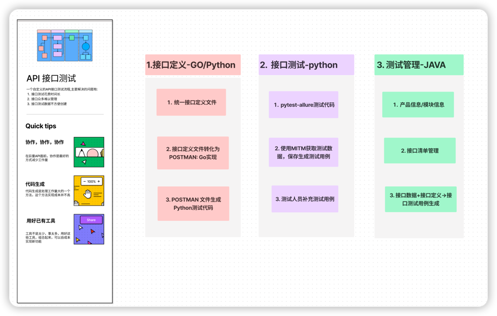

### 2.1 测试代码生成实现内容

1. 根据API开发定义接口文档生成postman文件和部分python代码
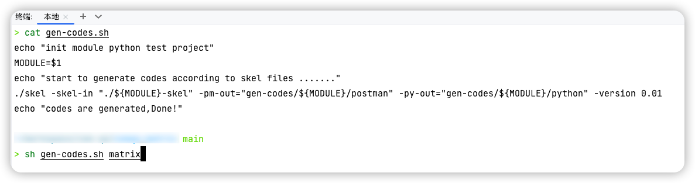
golang代码片段:
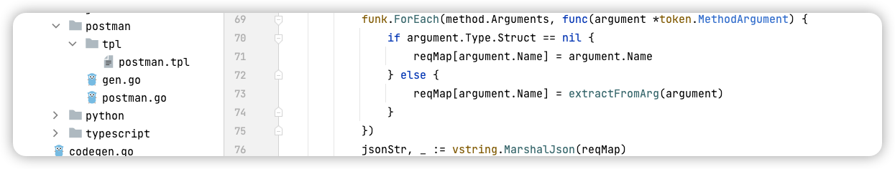
2. 生成python代码: python返回和请求都是采用类的方式而不是json，方便维护
python代码更好的结构化: 
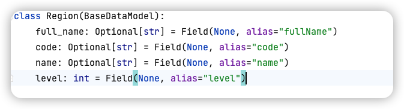
3. postman 文件可以少自己写一些很多请求，方便零时调用请求
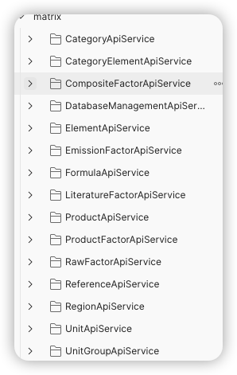
postman该有的前置脚本该有的也都有,:
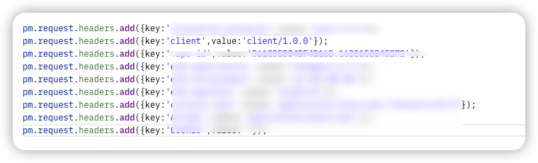
4. 根据postman文件生成接口调用和测试代码: 同时通过postman文件的方式，
   让代码生成更通用化，而不是只正对公司自定义协议

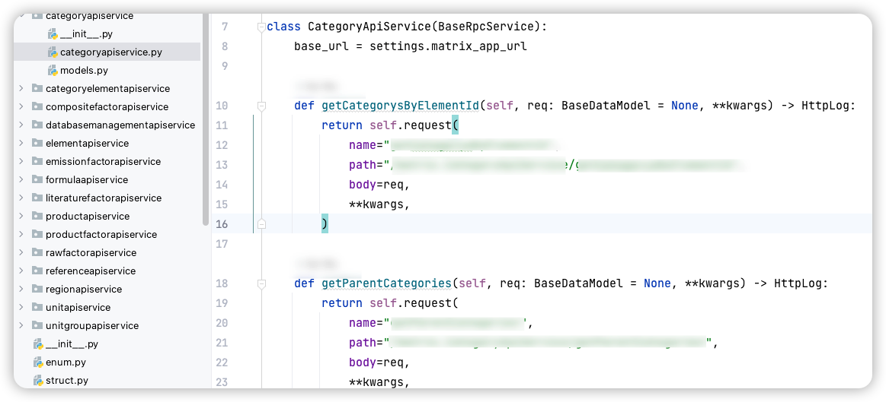
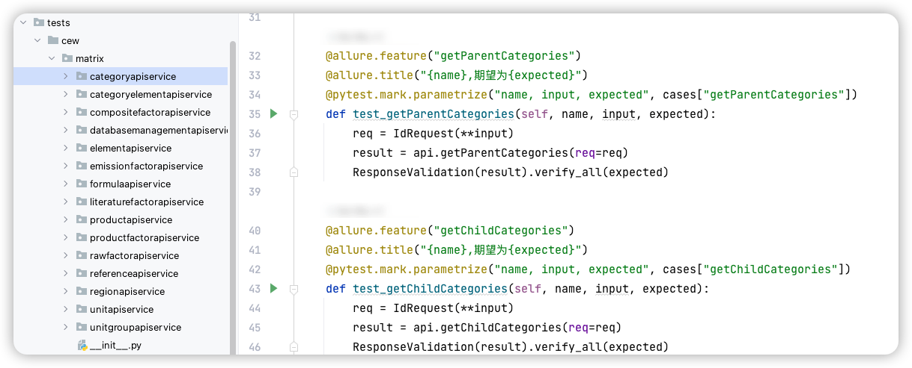

### 2.2 测试数据生成和测试用例生成

测试数据生成主要有两块内容:
1. 通过协议生成的数据结构，这块在postman中可以看到
2. 通过日常页面操作产生的数据获取
3. 融合1和2的数据，生成测试数据

具体怎么做？
1. 使用mitmproxy，获取运行测试过程中的数据，并且保存到数据库,算是某种录制方式
2. 通过一个管理平台让同学们可以通过页面操作生成测试用例数据
3. 测试用例数据可以直接在python代码中使用

同学问实现这些难吗？其实也没有那么难，因为有工具可以方便的给你用:

- 录制部分的其实主要就一个python文件,核心代码就这么多:
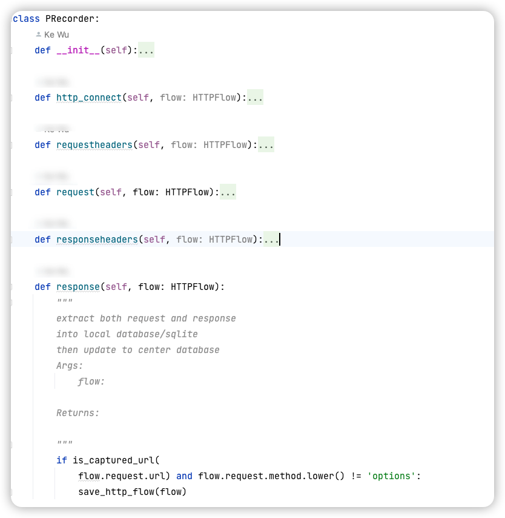
- 管理平台代码其实也很少,使用了一个JAVA类似于低代码工具,也是很少代码就实现:
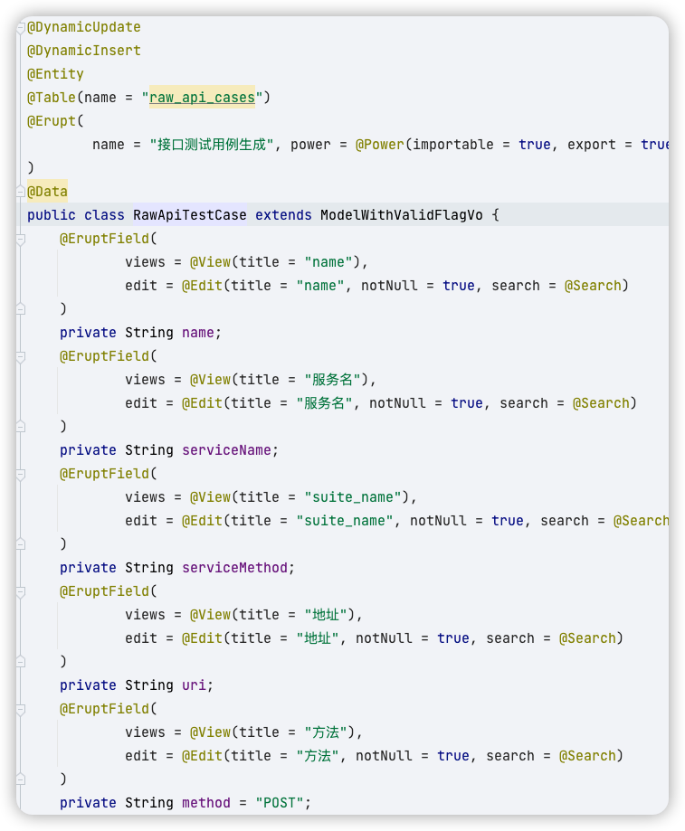

### 2.3 接口清单变化和测试用例生成

接口可能有些变化，所以有必要让API可以有一个清单让同学们了解API的变化情况，具体怎么做?
1. 上传生成的POSTMAN文件保存到数据库
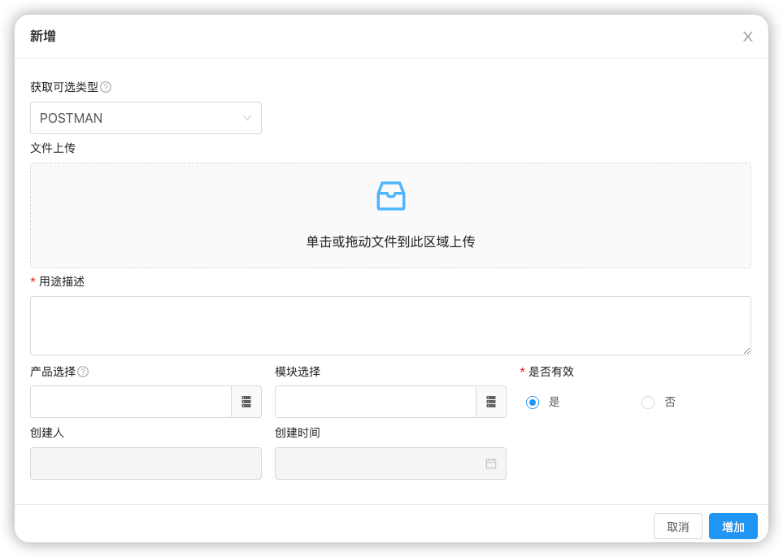
2. 保存POSTMAN中的接口,并且标注出那些是新加的，那些是改变的，那些是已经知道的
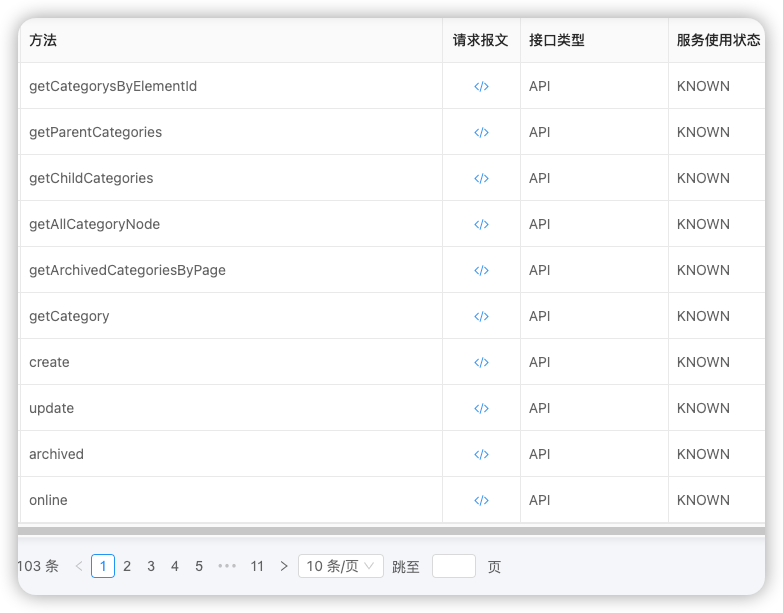
3. 测试数据生成: 已经知道接口定义和有部分录制数据，直接点击生成原始接口测试用例就可以
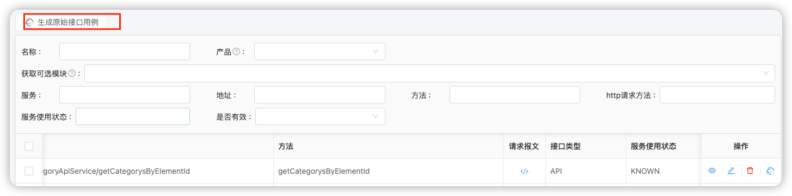
4. 生成的测试数据/测试用例可以编辑和导出:

5. 下载测试用例数据之后，接可以在python代码中运行
6. 如果有额外需要加的测试用例，可以直接在代码中做修改

## 3. 总结一些在实现这些化的成本

1. golang代码生成: 1.5天
    * 协议定义是开发完成的，我这边成本是零
    * 代码生成代码，由于开发也在使用代码生成，我在这个基础上加入postman和python,成本是1.5天左右
2. python接口自动化代码: 5天
    * python接口自动化基础库实现花了4天时间，包括:
      * httpx调用封装，支持http/http2
      * database访问封装: 使用ORM/pydantic 方式
      * 常用的工具类方式:  copy/paste
    * python接口代码生成器: 1天
      * jinja2模版实现
3. mitm proxy数据录制: 1天
   * 学习mitmproxy的机制
   * 解析请求，保存数据库
4. 接口后台管理工具: 3天
    * 使用一个JAVA开源的低代码工具，不用写前端代码
    * 产品配置管理
    * 接口清单管理
    * 接口数据管理
    * 测试用例生成
    * postman文件上传
总体而言在我使用这些工具的过程中,花费不多，但是每个人实际情况可能不同，只是作为参考.不代表任何含义.

## 4. 收获是什么？

1. 工具有很多，如何组合起来使用满足自身需求
2. python收获: 重新认识了新的python的一些库
   * poetry: python 包管理工具，比requirement好用
   * python 命令行工具构建: typer/fire
   * python ORM： sqlmodel/sqlalchemy/repository pattern
   * python 使用依赖注入方便写sdk
   * python pydantic使用，如何更好的结构化数据
   * python对于测试人员来说学习的路径图
3. 内部平台收获: 使用低代码工具能够极大的帮助开发效率
   *  使用低代码工具，一个JAVA类就可以实现前后端功能最简单的CRUD功能
4. 一些观念的变化
   * 一遍一遍看语法，效率太低，花20%的精力了解80%现实中马上用到的东西
   * 语言和语言差别越来越小，都有类型
   * API测试，可以和命令行，RPC，函数都可以统一起来看，协议就是一次函数调用
     函数就是，函数名+参数，协议只是把这个分散到了不同地方
   * 数据结构+算法，这个才是最不变的东西,为什么这么说，自己遇到的例子是:
     * EXCEl读取到python/java 类，就一行代码给外部使用
     * freemind/xmind转化为数据库保存，也是同样道理
     * postman 文件转化保存到数据库也是同样的道理
5. 一小点一小点的知识和代码使用，大部分可以在30分钟说完，最主要的是练习熟练程度
   各种知识点的30分钟的介绍，正在准备中，希望可以给我们TEAM的同学有些帮助
6. 知己知彼，可以更深入的测试,在自己写的过程了解开发细节，也可以推测和你差不多的开发在哪里容易出错