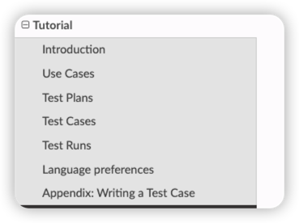

# KiwiTCMS: open source test management

首先这个项目太老了,可能不适合使用了,主要了解思路的管理方式.

## 业务分层

- [docs](https://kiwitcms.readthedocs.io/en/latest/guide/usecase.html)

核心概念:

- Use Cases
    Manual Testing
    Writing a Test Plan
    Manager Assigns Testing Priorities
    Cloning a Test Plan

- Test Plans
Searching for Test Plans
Creating a Test Plan
Cloning a Test Plan
Editing a Test Plan
Change History
Bulk update
Disabling a Test Plan
Re-enable a Test Plan
Exporting Test Cases from a Test Plan

- Test Cases
Add an existing test plan to test case
Create test case from a test plan
Add an existing test case to test plan
Cloning Test Cases
Reviewing a Test Case
Changing the order of Test Cases in a Test Plan

- Test Runs
Searching for Test Runs
Creating a Test Run
Add Test Cases to an existing Test Run
Cloning a Test Run
Editing a Test Run
Changing the status of a Test Run
Deleting a Test Run
Executing a Test Run